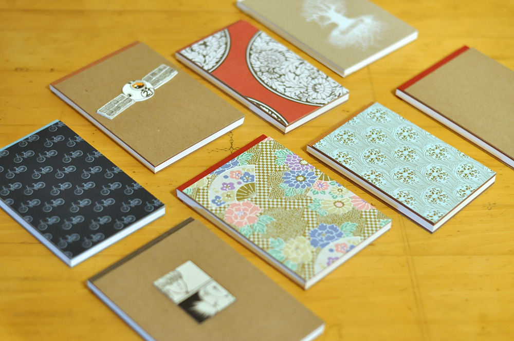
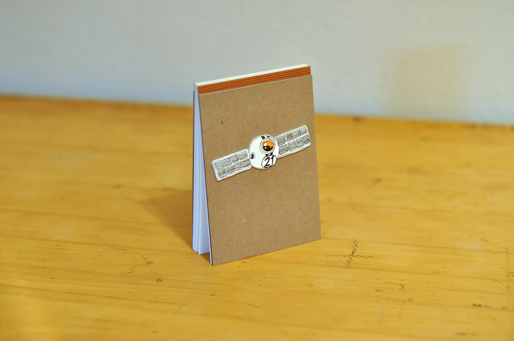
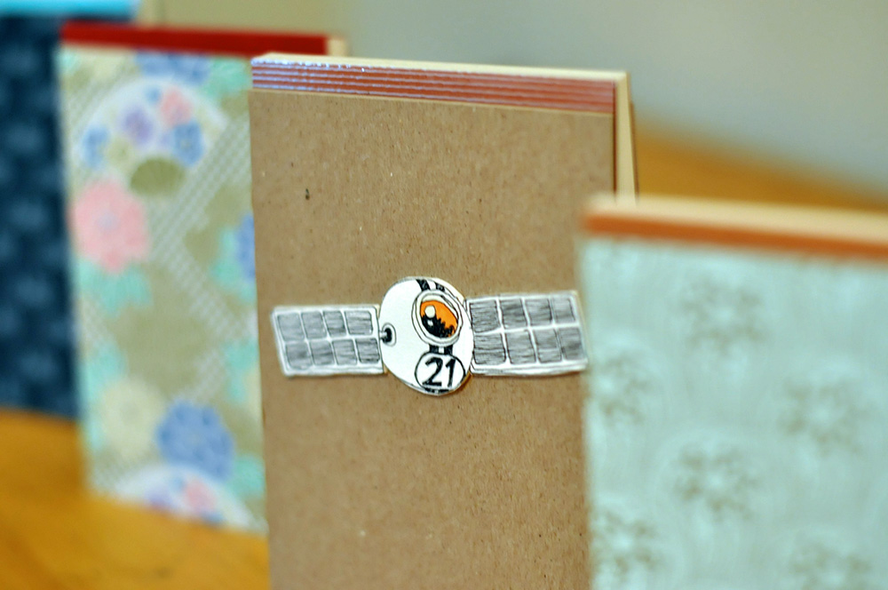
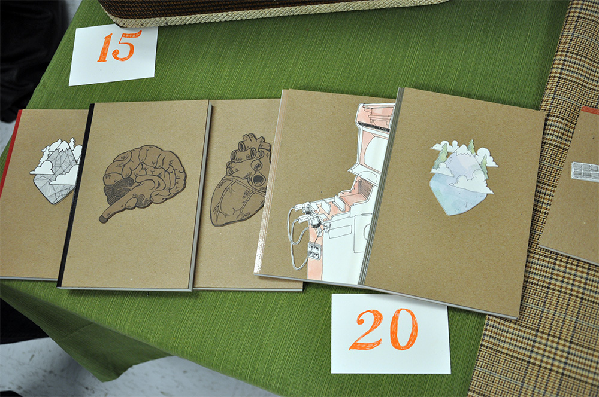

Making things by hand is a passion of mine. Generally I spend the majority of my day at a computer - at work and at home - so sometimes I need to get away and do something tangible. Bookbinding is a skill picked up in college and something enjoyable to me.

[Bookbinding](http://skl.sh/1dgs9HO) is fascinating because books are everyday objects that you never think about. Books are so common and we are so used to them it's amazing to think, hey, this used to be pieces of paper and thread, and before that a tree, and now a tangible object. Before I was taught the art of making books I never even considered it something I could personally do, or even enjoy. I mean, who makes books anyway, can't you just buy a book or notebook at the store? Yes, you can, but by making my own books from scratch created a bond with the item that normally would not have happened.

## Getting into Skillshare

The discovery of [Skillshare](http://skl.sh/1i98Irl) - an online education platform - interested me for the classes it offered but also because it gave me the chance to create my own course work and teach others online without previous experience; an opportunity that I otherwise would not have considered. (See how these things are relating? Never thought about bookbinding, but now I love it. Never would have considered teaching, but an opportunity appeared). I chose my topic based on my own skills and experience and interest in the subject. Bookbinding is something of a lost art, we have machines that make books for us, but it feels so great to make a book by hand and I wanted to share that feeling with others.

Getting into bookbinding is tricky, confusing, and complicated. That's why I started out teaching Perfect Binding. Making perfect bound books is a great way to enter the world of bookbinding because (compared to other types of books that use stitching) a perfect bound book requires less material, unique tools, and can be completed between 30 minutes and an hour.

Now I'm not saying bookbinding is for everyone, because honestly only the cool kids are invited, but I would encourage everyone to try it out, who knows you may love it, you may not, but I can guarantee you will learn something cool, about bookbinding and about yourself. You can [join the class](http://skl.sh/1i98Irl) on Skillshare, or if you have any questions find me on Twitter at [@calebsylvest](https://twitter.com/calebsylvest).

### What You Will Learn

- **Materials &amp; Tools.** We will cover materials and tools needed, where to find them, and brands and tips to keep an eye out for.
- **Process.** We will cover the step-by-step instructions of making a handmade perfect bound notebook.
- **Tips &amp; Tricks.** Throughout the class we will talk about tips to improve craft, work more efficiently, use our tools better, and be awesome!
- **Ideas &amp; Alternatives.** We will discuss alternative ways to make books, materials to use, and how to make things new and exciting.

##### Super cool examples of books you can learn to make

