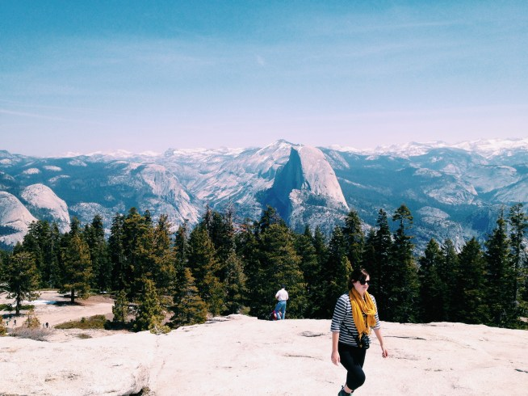
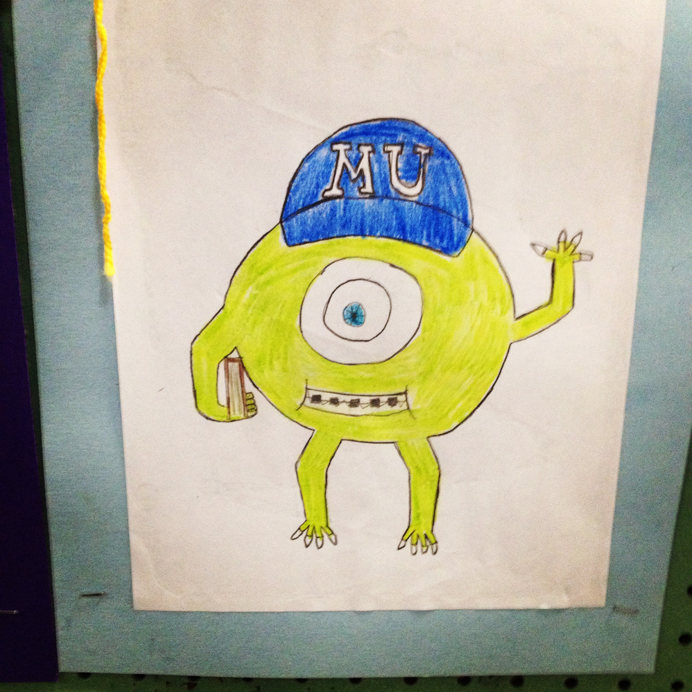
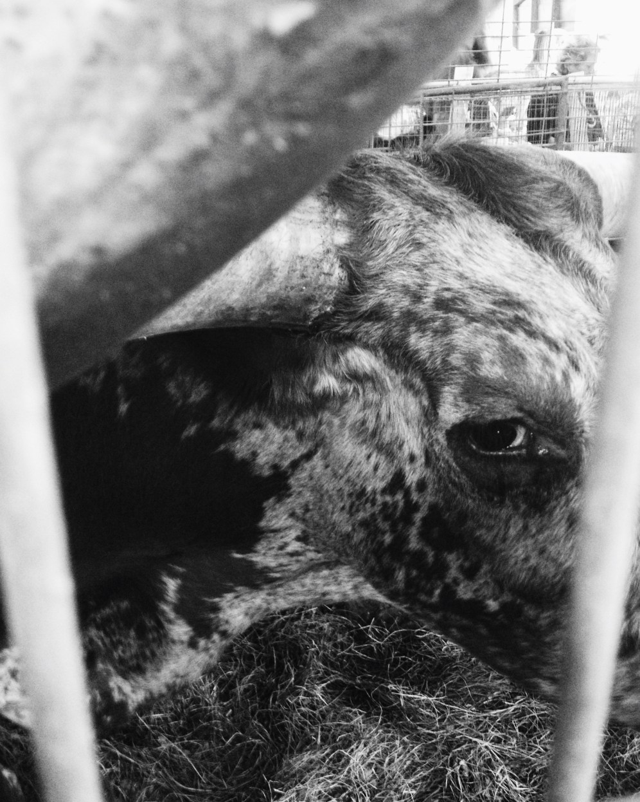

Yeah, I know I’m late to the game, but before 2015 gets away from me I wanted to share a brief overview of what happened in 2014 for me and my family.

## Travel

2014 was a year of travel, and I loved it! I went on multiple trips with family and friends, and because I now live in Dallas, TX and am much closer to family in Louisiana my wife and I made several trips home throughout the year.

#### San Francisco &amp; Yosemite – April 18 to 26

My wife and I flew out of DFW International Airport on Good Friday headed to San Francisco. San Francisco is one of my favorite cities in the US and a place I would love to move if it didn’t cost an arm-and-leg. Haley’s uncle picked us up from the airport and gave us a half-day tour of the area before connecting us with my family (mom, dad, sister, and brother-in-law). My family took off that night headed to a rental in Yosemite. Yosemite is several hours outside of San Francisco.

We spent several days exploring Yosemite; hiking, biking, and lounging (hint: rent a bike in Yosemite, it makes getting around the park much easier and enjoyable, save walking for the awesome hiking trails). The sights are astounding, and I can’t do them justice with words. I’ve never been much of a photographer, but the Yosemite trip is the first time I intentionally carried a camera (aka iPhone 4S) and made a point to document the trip. In total I shot around 1000 images and developed more confidence in my ability to shoot a decent photo, at least a landscape.

A collection of my photos are [available on my VSCO grid](http://calebsylvest.vsco.co/grid/1).

The rest of the trip was spent in San Francisco, exploring the area and visiting attractions like Alcatraz.

#### Alaska – July 30 to August 9

In August my wife and I joined her family on a cruise to Alaska. We flew out of Dallas, and while waiting for our departure saw the brothers and sister of [The Band Perry](https://www.thebandperry.com/), which is funny because while I lived and worked in Nashville I did work for them, including the first design and build of their current site, but never met them. We flew into Vancouver, Canada to board the cruise ship. The ship sailed north along the Alaskan coastline, stopping in cities everyday for excursions.

Alaska is beautiful, and I would recommend visiting via a cruise line. The trip was the perfect balance of rest and excursion hiking. I read, ate food, spent time with family, slept, hiked, took photos, and even saw a bear eating another bear. Yes, that’s right! While on a bus tour through a park we came upon a bear kill. Turns out the number one predator of bears are other bears.

#### Austin/Ranch – Labor Day Weekend

Labor Day weekend was spent away with a group of friends. We traveled to Austin for part of the day, then to a ranch in the country. It was great to get away, spend time with friends and grow our relationships, and unplug from technology (we had zero internet or cell reception).

[Instagram](https://instagram.com/p/scb4tKGPkU/)

Many great things happened, but discovering dung beetles rolling poop was a highlight!

#### Washington Parish Fair – October 17 &amp; 18

My family has gone to the [Washington Parish Free Fair](http://freefair.com/) for as long as I can remember. My parents grew up around Franklinton, Louisiana about an hour north of Mandeville where I lived until I left for college. The Washington Parish Free Fair is an annual tradition that we have shared and offers many fond memories. I've only been able to go sporadically over the past decade while attending college and then moving out of state, but now that I live in Texas it's easier to make a trip to south Louisiana.

The fair is like any other with food, entertainment, rides, exhibits and more, but unlike most fairs, entry is completely free! One of the historic attractions, Mile Branch, contains log cabins and shops dating back to when settles moved into the area. One of the cabins is actually from my early Sylvest relatives, purty cool, eh!

#### Arkansas – November 21 to 23

In late November, my wife and I traveled to Arkansas for a weekend get-away, just the two of us. The weather wasn't great, wet and overcast, but we were able to get out some to explore the local town and park.

## Family

The biggest news of 2014 was when we found that we were expecting! In June of 2014 my wife discovered she was pregnant after a couple days not feeling well. The news was a surprise, but delight. Sharing the news with family and friends was fun, and as you can imagine, the rest of the year was spent preparing for the baby and traveling to baby showers.

Our son will be born mid-February. We are going through the last of our birthing classes and prepping for the much anticipated day.

---

Living in Texas has given the opportunity to see family in Louisiana more often. We had family visit us in Texas several times throughout the year, traveled back to our parents homes, went on two family vacations, and spent the holidays with family.

## Bookbinding

Bookbinding has been a hobby and side project for the past few years. I learned how to bind several styles of books while in school and have made, gifted, and sold books every year since. In November of 2013 I created a video course and published it on [Skillshare](http://skl.sh/1i98Irl). I had never taught anyone anything before, didn’t have any skill in shooting and editing video, and had no clue if an audience existed.

I published the course and waited. A few students trickled in over the next months, but growth was slow. After all, bookbinding is not an art many people think about or consider. But throughout the year the course slowly grew and grew, and I eventually published a second bookbinding course in October. Adding a second course caused a spike in new students and greatly helped grow the old class as well as the new. By the end of the year my first class on [Perfect Bound Binding](http://skl.sh/1i98Irl) has grown to over 1000 students and my second class [Coptic Stitch Binding](http://skl.sh/1i98Irl) is already past 700.

I also sell the books I make. In Spring and Fall of 2014 I joined other artist and makers at the [Texas Avenue Makers Fair](http://texasavemakersfair.com/) in Shreveport, Louisiana to sell Perfect Bound and Coptic Stitch books, as well as art prints.

The most important lesson I've learned from creating and selling my bookbinding courses is that *I can make money on my own!* Growing up I never considered the idea of entrepreneurship in any fashion, and while selling a couple of classes isn't exactly an entrepreneurial path, it has expanded my view of the career world and opened new doors. I always thought you had to work for a company to make a living, and never knew why people would choose to own their own business (I know, sounds naive right? But that's what was in my mind from an early age).

A lot more could be said about my growth of entrepreneurial understanding and aspirations, but I think that will be saved for another time.

## Professional

I've now been employed at [Lift UX](http://liftux.com/) and lived in McKinney, TX for a year and a half. A number of interesting projects passed across my desk in 2014 (unfortunately I have not update [my portfolio](http://calebsylvest.com/) at all, but hope to do so in the near future).

A few projects:

- **[TURN: Washington's Spies](http://www.amc.com/shows/turn)**. Designed the experience and interface for a new show on AMC.
- **Allergan**. Designed an internal tool for the people at health-care giant Allergan.
- **Frito Lay**. Designed an internal management tool for the creative team at Frito Lay.
- Other things I can't talk about yet... but soon.

## Personal

Lots of things happen every day and every week, here are a few more things that happened in 2014:

- **Startup course**. Every fall [Y Combinator](https://www.ycombinator.com/) teaches a course at Stanford on [How to Start a Startup](http://startupclass.samaltman.com/). This year the class was posted online and open to all. I joined thousands of students online to watch the lectures and read and discuss what we were learning. If you are part of the tech industry, or just interested in entrepreneurship I highly suggest going through the course content.
- **Made new friends**. Moving is tough, and making new friends can be even more difficult. But since moving to Texas I have been blessed to find new friends in McKinney, at church, and around Dallas. I look forward to growing these relationships for years ahead.
- **Budget and finances**. For the first time I really started managing my budget and finances on a micro level. I spent time learning about finances, budgeting, and investing then putting into practice what I learned. I now use and suggest [YNAB](http://ynab.refr.cc/4XQMQZS) for budgeting and management, and [Betterment](betterment.com/invite/calebsylvest) for personal investing. If you don't know how to get started investing check out my list of reads called [Everything You Need to Know About Investing](https://gibbon.co/calebsylvest/everything-you-need-to-know-about-investing).
- **Yoga**. I became a yogi! I started yoga in the fall with a friend. Yoga has helped with my back pain and given me a non-strenuous method of exercise that I can participate in anytime (especially in the winter). I was nervous and leery of going to a yoga class, but starting with a friend and a discount Groupon made the experience easy to get started.

## Side Projects

One early 2014 goal was to create and publish a couple of side projects. And while I worked on several, none ever made it anywhere (except my bookbinding courses).

A few projects:

- ~~w4form.me~~ DEAD
- ~~onlinebookbinding.com~~ DEAD
- [helixpowered.com](http://helixpowered.com/). Technically still there, but essentially DEAD.

~~I still have high hopes for Helix, so keep your eyes peeled in 2015!~~

## This Blog

Well, I can't say I finished 2014 out strong with this blog. The first half of the year saw about a dozen solid posts. But the rest of the year either stagnated or I only published softball post. Don't get me wrong, I'm still proud that I started a blog and created a short portfolio of articles, but in the new year I would like to get back into it.

Here's to 2015!
